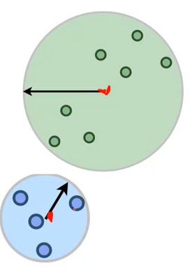

# K-means

- Distance function L2 type.
- C = ${C_1,C_2,.......,C_k}$, cost(C) = $\sum_x$ $\underset{c_x}{min}$ $d(x,Cx)^2$,
- where d is euclidean distance. $C_x$ is chosen as the nearest point to data X.

#### Alternative View

**Objective** : Define best k-clustering of the data by -

- Minimizing the variance of each cluster. i.e,  the cost of K-mean is the variance of the point in each cluster.
- The mean $C_i$ = $\frac{1}{|C_i|}$ $\sum_{x \epsilon C_i}$x is the expected location of a point.
- Therefore, variance of $C_i$  = $\sum_{x \epsilon C_i}x$ $||x - C_i||^2$

Connection with max likelihood estimation :

Consider the likelihood of set points if center is u, co-variance is $𝜎^2$I. Take Gaussian PDF.

p($x_1,x_2,.......x_k | 𝜇,\sigma$) $\propto$ $\underset{i}{\prod}$ exp(-$\frac{|x_i-\mu|^2}{𝜎^2}$)  $\propto$ exp(-$\underset{i}{\sum}$ $\frac{|x_i-\mu|^2}{𝜎^2}$)

Taking log of probability likelihood,

log(p($x_1,x_2,.......x_k | 𝜇,\sigma$)) $\propto$ $\underset{i}{\sum}$ $|X_i - 𝜇^2|$ + function($\sigma$,dimension).

Likelihood of gaussian is exactly the same as K-means cost of each set of data points.

**Choosing Optimal position for Center**

Given partition C, C is the proposed center then C must be equal to u. i.e, if  optimal center is given then optimal partition can be determined and vice versa.

**Lloyd’s algorithm** (Iterative algorithm)

Steps:-

1. Find current centers of partition.
2. Assign Points to nearest centers.
3. Recalculate centers.
4. Iterate the above 3 steps.

Stopping Criteria:-

1. When no points change clusters.
2. When cluster centers don’t shift much.

**Analysis**

- K centers, N points, d dimensions
- Time taken to calculate the new cluster - O(kNd)
- Time for the new center - O(Nd).

<footer>
Author(s): Aditya Shakya, Shantanu Sahu, Varun Barala
</footer>
