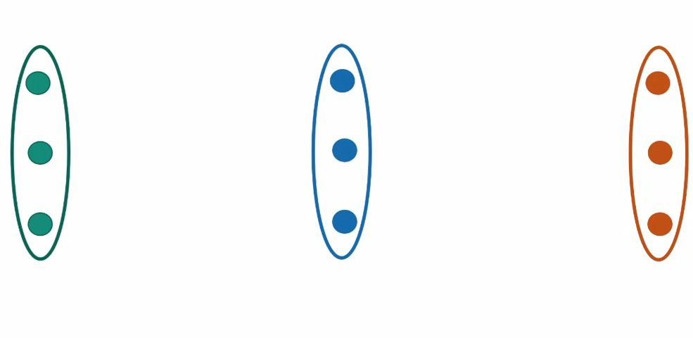
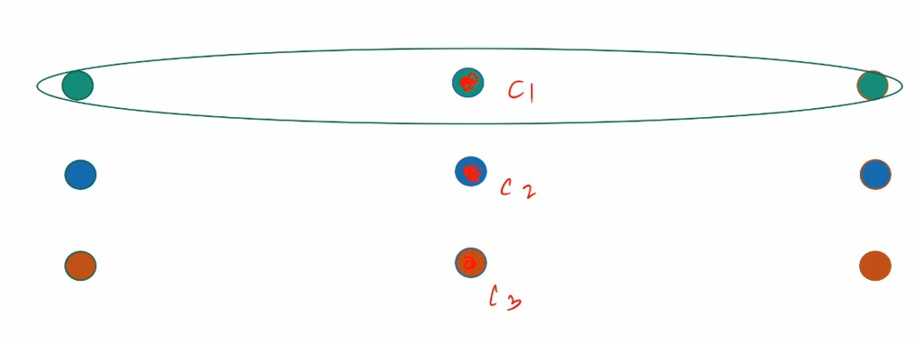
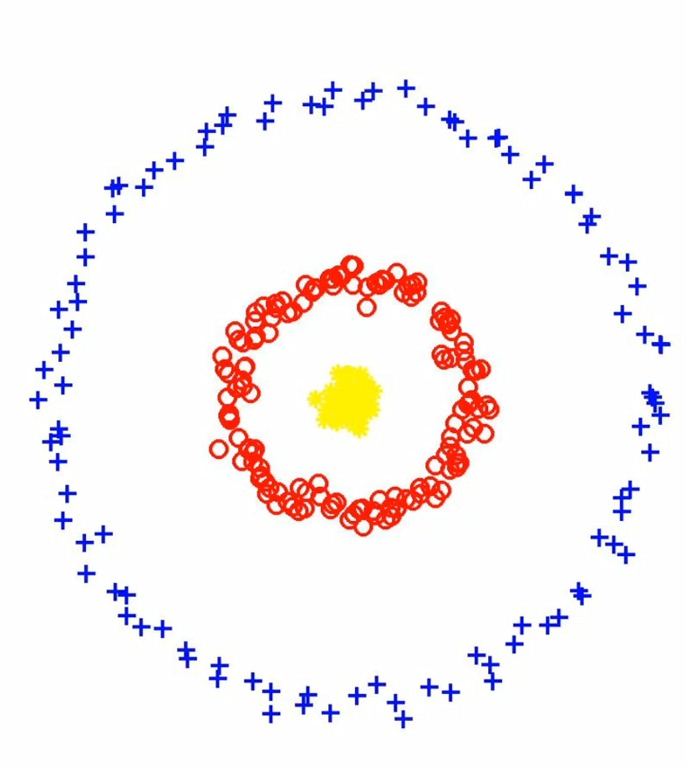
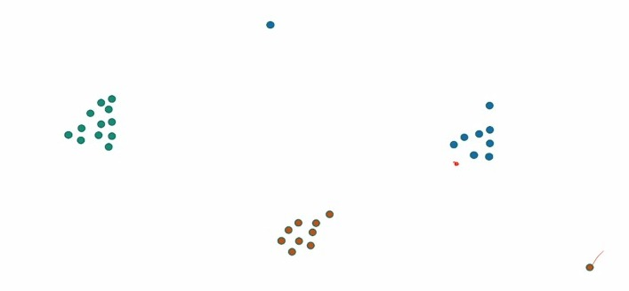

# Lloyd's algorithm, convergence?

For each partition there is a center.

- At the $t^{th}$ step of iteration :

  - Let $C_1^t, C_2^t, ........C_k^t$ = Current partition of data at $t^th$ step. Where  $(C_1^t, C_2^t, .........C_k^t) \subseteq {Data Points}$

  - Find $\mu$ $M_1^t$, $\mu$ $M_2^t$, ..........$\mu$ $M_k^t$, where $\mu$ $M_i^t$ = $avg(C_k^t)$ and $\mu$ $M_i$ is the optimal center for $i^{th}$ partition.

  - Find $C_1^t+1, C_2^t+1, ..........C_k^t+1$, where .$C_k^t+1$ is set of points whose closest center is $\mu M_i^t$

- Now, we claim that at every step algorithm the cost is non-increasing i.e. we say the following :

  - The step for finding the center, the cost is non-increasing.

  - Step for the closest center, the cost is non-increasing because for every step we find minimum center which decreases the  distance for some of the data points and for the rest it remains the same.

  - Claim :- for X = { $x_1, ........, x_n$} and for any c. cost(X, c) = ${\sum_{}} |x_i - \mu M|^2 + n| \mu M - c|^2$.
  - Where cost (X, $C_i$, $\mu M_i$) is the cost of partition $C_i$ and center $\mu M_i$.

  - Hence, cost(X, c) $\ge$ cost(X, $\mu M$)

- Non-increasing Cost :

  - Here cost(X, $C_i$, $\mu M_i$) is the cost of partition $C_i$ and center $\mu M_i$.

  - For new cluster assignment step
    - cost (X, $C_i^t+1, \mu M_i^t+1$) $\le$ cost(X, $C_i^t, \mu M_i^t$)

  - For new center calculation step
    - cost (X, $C_i^t+1, \mu M_i^t+1$) $\le$ cost(X, $C_i^t, \mu M_i^t$)

Therefore, we claim that Lloyd has a convergence, hence it will not happen that for k center let the cost is 1000, for k+i it becomes for 100 and for k+i+j center it again increases. This is not possible.

It is known that in some datasets, Lloyd's Algorithm can take exponential ($2^\sqrt{n}$) number of steps. This is an unrealistic number of steps for the algorithm. For any algorithm the maximum complexity we want is O(nlogn) or O$(n^2)$

Another much bigger problem is that the decision about the thing where the Lloyd algorithm will converge to is actually dependent on the initializations. Therefore, our answer depends on the center which we have started with in the algorithm.

#### Example

1. 


    a. Good center case.

    


    We have good initialization where each column have one center.

    b. Bad center case.

    

    Bad initialization is where all three center in one column as the k-means cost has increased a lot. We will discuss this case in density based clustering.

2. 

    This is a case where center based clustering is not appropriate. This kind of separation do not give an optimal cluster in k-means algorithm.

### How to initialize?

The question in front of us is how should we initialize the points. There can be many kind of choices to make initialization. But we will see for few of them that why they are not an appropriate initialization and we will look into the appropriate method.

**What if we initialize using the farthest points?**

In this kind of initialization we choose our next center to be the farthest point from the existing set of centers.



But from the above case we see that choosing a center from the farthest point is sensitive to the outliers. Meaning that for just 1 or 2 points which lie completely outside the picture we choose those point instead of the main cluster that we want to choose.

**What if we choose our next center uniformly at random?**


This kind of initialization is not worthy for the case as shown above where there is a dense cluster along with some other cluster far away. Therefore, we outlaw choosing uniformly at random.

**A Mixed Strategy**

What happens if we mix the above two different strategies. Let us see what are the things we want to be included in the initialization which are discussed in the above two strategies :

- If there are number of points that are far away from already chosen centers, then the probability of choosing the next center should be more in the favours of these points.

- If there is a "dense cloud" of points anywhere, near or far, the choice of next center should be more inclined towards these points too.

Now, the question arises in front of us is can we achieve both by assigning each point a "Probability of being chosen."

### K-Means++

This is a algorithm to initialize the centers. We define D(x) as the distance of the point x from the current set of chosen centers.

We define the probability of chosen point as :

  $\frac{D(x)^\alpha}{\sum_x {D(x)^{\alpha}}}$

  If $\alpha$ = 0 : Then, we choose the points as uniformly at random

  If $\alpha$ = ${\infty}$ : Then we choose the points according to the farthest point, because with $\alpha$ as infinity, the limit for the maximum distance goes to 1, whereas the limit for rest of the points goes to 0.

  The optimistic $\alpha$ is when it values is 2. Therefore, at $\alpha$ = 2 : k-means++

```{NOTE}
After addition of each center, the distance D(x) need to be updated for each point i.e. probabilities for each data point is changed
```

### Center initialization algorithm

1. The first step is we choose the first center arbitrarily.

2. While |C| < k:

   - Where |C| is the number of centers and k is the number of desired clusters.

   a. We update D(x) for all points x. (We choose the D(x) for each point as the distance between the point and it's closest center.)

   b. Choose a point at random according to ${\frac{D(x)^2}{\sum_x D(x)^2}}$ and add to C.

### What is the benefit?

1. **Theorem (AV07)** : k-means++ algorithm always return a $\theta$(log k) approximation.

2. **Theorem (ORSS06)** : A slightly modified version of k-means++ algorithm is able to reach O(1) approximation if the data is "Nicely Clusterable" with k clusters.

#### Explanation of "Nicely Clusterable"

Dataset X is "nicely clusterable" with k clusters if going from k-1 to k clusters reduces the cost significantly. That is $OPT_k$>>> $OPT_k+1$.

In other words a cluster is nicely clusterable if :

cost*(X,k) = optimal cost with k cluster.

X is (k, $\epsilon$) separated if

cost*(X, k) $\le \epsilon^2$ cost*(X, k-1), where $\epsilon \le 1$

<footer>
Author(s): Aditya Shakya, Shantanu Sahu, Varun Barala
</footer>
